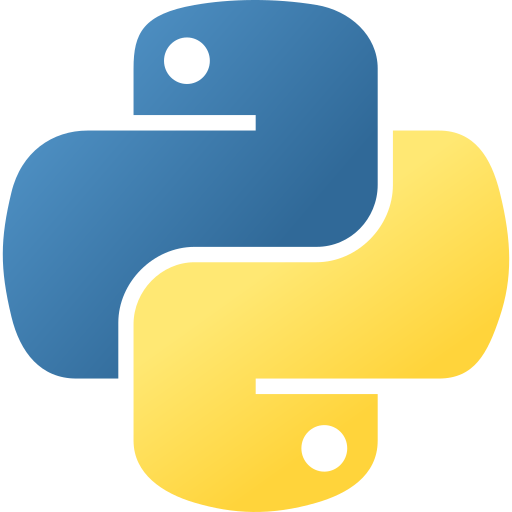
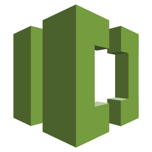

# Hi there, I'm Elaf (she/her)👋

## I'm a student at Monash University Malaysia and I am currently looking for internship opportunities!!
- 🔭 I’m currently working on "Copy-paste app usage actions from recordings" for final year research and "ReportCare application" as a part of my final year project. 
- 🌱 I’m currently learning React Native. 
- 👯 I’m looking for internship as a full stack developer! 

### Connect with me:

[<picture>
  <source media="(prefers-color-scheme: dark)" srcset="/img/linkedin-dark.svg">
  <source media="(prefers-color-scheme: light)" srcset="/img/linkedin-light.svg">
  
</picture>](https://www.linkedin.com/in/elafaa/)
&nbsp;&nbsp;
[<picture>
  
</picture>](mailto:elafasalh@gmail.com)

### Languages and Tools:
<picture>
  
</picture>
<picture>
  
</picture>
<picture>
  
</picture>
<picture>
  
</picture>
&nbsp;&nbsp;
<picture>
  
</picture>
<picture>
  
</picture>
<picture>
  
</picture>
<picture>
  
</picture>
<picture>
  
</picture>

